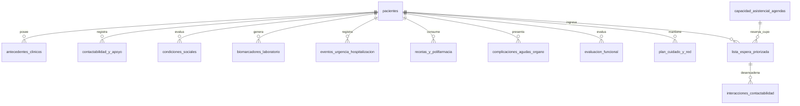

# 🗄️ Especificación de Bases de Datos Sintéticas y Fuentes de Información

## Herramienta de IA para la Repriorización Inteligente de Listas de Espera en Diabetes Mellitus Tipo 2 (DM2) en el Marco de la Estrategia ECICEP

---

## 📋 Visión General y Propósito del Documento

Este documento especifica la **arquitectura técnica de bases de datos sintéticas/ficticias** necesarias para construir, probar y validar la herramienta de repriorización inteligente de listas de espera para Diabetes Mellitus Tipo 2 (DM2) en la Atención Primaria de Salud (APS) e integración con la Red Asistencial en Chile.

La especificación se fundamenta en los criterios técnicos del **Modelo de Cuidado Integral Centrado en las Personas (ECICEP)**, la **Norma Técnica N° 118 / Res. Ex. N° 03 del MINSAL** (Registro Nacional de Listas de Espera) y los requerimientos funcionales de trazabilidad, omnicanalidad y versionado inmutable definidos para la herramienta.

---

## 🧮 Algoritmo Central de Priorización ECICEP (APS - DM2)

El cálculo del puntaje de prioridad dinámica de cada paciente se calcula según la fórmula oficial:

$$\text{Puntaje Total ECICEP} = C1(\text{HbA1c}) + C2(\text{ERC}) + C3(\text{Urgencia}) + C4(\text{Social}) + C5(\text{Polifarmacia})$$

| Criterio Clínico / Social | Indicador Evaluado | Ponderación de Puntaje |
| --- | --- | --- |
| **Control Metabólico ($C1$)** | • HbA1c $< 7.0\%$ • HbA1c $7.0\% - 8.9\%$ • HbA1c $\ge 9.0\%$ o descompensación aguda | **0 puntos** **2 puntos** **4 puntos** |
| **Complicación Renal ($C2$)** | • RAC $< 30$ mg/g y VFG $\ge 60$ mL/min/1.73m² • RAC $30-299$ mg/g o VFG $45-59$ mL/min/1.73m² • RAC $\ge 300$ mg/g o VFG $< 45$ mL/min/1.73m² | **0 puntos** **1 punto** **3 puntos** |
| **Uso de Urgencia ($C3$)** | • Sin atenciones de urgencia por patología crónica • 1 atención en SAPU/SAR/URG en el último mes • $\ge 2$ atenciones en urgencia u hospitalización en 6 meses | **0 puntos** **2 puntos** **4 puntos** |
| **Riesgo Social / Redes ($C4$)** | • Autovalente con red de apoyo efectiva • Autovalente con riesgo o red familiar parcial • Sin red de apoyo, abandono o cuidador colapsado | **0 puntos** **1 punto** **3 puntos** |
| **Polifarmacia ($C5$)** | • $< 5$ fármacos diarios permanentes • $5 - 6$ fármacos diarios permanentes • $\ge 7$ fármacos diarios permanentes | **0 puntos** **1 punto** **2 puntos** |

* **Prioridad Alta (Puntaje Total $\ge 10$ Puntos):** Asignación prioritaria de Ingreso Integral de Dupla presencial (7 a 14 días).
* **Prioridad Media (Puntaje Total $5 - 9$ Puntos):** Asignación de Control Integral presencial (máximo 30 días).
* **Prioridad Baja (Puntaje Total $< 5$ Puntos):** Agendamiento regular y seguimiento telemático programado.

---

## 📐 Diagrama de Relación entre Tablas Sintéticas (Modelo ER)

---

## 🗃️ Sección 1: Estructura Detallada de las 13 Bases de Datos Sintéticas

### 1. Tabla `pacientes` (Datos Personales y Demográficos)
* **Propósito:** Registro maestro de identificación del usuario.
* **Clave Primaria:** `id_paciente` (VARCHAR/UUID)

| Campo | Tipo de Dato | Criterio / Formato Ficticio | Descripción / Regla de Negocio |
| --- | --- | --- | --- |
| `id_paciente` | VARCHAR(36) | `PAC-00001` | Identificador único del paciente. |
| `rut` | VARCHAR(12) | `12.345.678-9` | RUT ficticio anonimizado. |
| `nombre_completo` | VARCHAR(100) | `Juan Pérez González` | Nombre ficticio para pruebas de interfaz. |
| `fecha_nacimiento` | DATE | `1958-04-12` | Utilizado para calcular la edad actual. |
| `edad` | INTEGER | `68` | ECICEP aplica a mayor de 15 años. |
| `sexo_biologico` | VARCHAR(10) | `M` / `F` | Sexo registrado para REM y DEIS. |
| `cesfam_origen` | VARCHAR(100) | `CESFAM San Rafael` | Centro de salud emisor. |
| `sector_comunal` | VARCHAR(50) | `Sector Azul` | Sector territorial dentro del CESFAM. |
| `prevision_tramo` | VARCHAR(10) | `FONASA A`, `B`, `C`, `D` | Tramo de previsión de salud pública. |

---

### 2. Tabla `antecedentes_clinicos` (Multimorbilidad y Estratificación ECICEP)
* **Propósito:** Registrar diagnósticos y clasificar la multimorbilidad en M2 (2-4 condiciones) o M5+ (5+ condiciones).
* **Clave Primaria:** `id_clinico` | **Clave Foránea:** `id_paciente`

| Campo | Tipo de Dato | Criterio / Formato Ficticio | Descripción / Regla de Negocio |
| --- | --- | --- | --- |
| `id_clinico` | VARCHAR(36) | `CLI-00001` | Identificador del registro clínico. |
| `id_paciente` | VARCHAR(36) | `PAC-00001` | Referencia al paciente. |
| `diagnostico_principal` | VARCHAR(100) | `Diabetes Mellitus Tipo 2 (CIE-10 E11)` | Diagnóstico primario de ingreso. |
| `comorbilidades_activas` | TEXT / JSON | `["HTA", "ERC Etapa 3a", "Dislipidemia"]` | Array de condiciones crónicas. |
| `conteo_condiciones_cronicas`| INTEGER | `4` | Conteo entero (2-4 = M2 | $\ge 5$ = M5+). |
| `estrato_ecicep_actual` | VARCHAR(10) | `G0`, `G1`, `G2`, `G3` | Estrato asignado en el CESFAM. |
| `tiempo_diagnostico_dm2_anios`| NUMERIC(4,1) | `8.5` | Años de evolución de la DM2. |

---

### 3. Tabla `contactabilidad_y_apoyo` (Vías de Contacto y Red Familiar)
* **Propósito:** Administrar canales omnicanal para la IA y datos del cuidador responsable.
* **Clave Primaria:** `id_contacto` | **Clave Foránea:** `id_paciente`

| Campo | Tipo de Dato | Criterio / Formato Ficticio | Descripción / Regla de Negocio |
| --- | --- | --- | --- |
| `id_contacto` | VARCHAR(36) | `CNT-00001` | Identificador del contacto. |
| `id_paciente` | VARCHAR(36) | `PAC-00001` | Referencia al paciente. |
| `telefono_celular_1` | VARCHAR(15) | `+56912345678` | Número principal para WhatsApp/SMS. |
| `telefono_celular_2` | VARCHAR(15) | `+56987654321` | Número secundario / familiar. |
| `correo_electronico` | VARCHAR(100) | `usuario@email.com` | Email para notificaciones escritas. |
| `canal_preferido` | VARCHAR(20) | `WhatsApp`, `SMS`, `Llamada` | Canal prioritario para agendamiento por IA. |
| `nombre_cuidador` | VARCHAR(100) | `María Pérez` | Nombre del tutor o persona de apoyo. |
| `parentesco_cuidador` | VARCHAR(30) | `Hija`, `Cónyuge`, `Vecino` | Vínculo familiar o comunitario. |
| `estado_cuidador` | VARCHAR(30) | `Efectivo`, `Riesgo Colapso`, `Sin Cuidador` | Evaluado para gestión psicosocial. |

---

### 4. Tabla `condiciones_sociales` (Determinantes Sociales y Criterio $C4$)
* **Propósito:** Almacenar variables de vulnerabilidad para calcular el Puntaje $C4$ de ECICEP.
* **Clave Primaria:** `id_social` | **Clave Foránea:** `id_paciente`

| Campo | Tipo de Dato | Criterio / Formato Ficticio | Descripción / Regla de Negocio |
| --- | --- | --- | --- |
| `id_social` | VARCHAR(36) | `SOC-00001` | Registro de condiciones sociales. |
| `id_paciente` | VARCHAR(36) | `PAC-00001` | Referencia al paciente. |
| `nivel_red_apoyo` | VARCHAR(30) | `Efectiva`, `Parcial`, `Abandono/Sin Red` | Define el puntaje del Criterio $C4$. |
| `puntaje_c4_social` | INTEGER | `0`, `1`, `3` | **$C4$:** (Efectiva=0 \| Parcial=1 \| Sin Red=3). |
| `tramo_rsh` | VARCHAR(20) | `40%`, `60%`, `80%` | Tramo del Registro Social de Hogares. |
| `zona_residencia` | VARCHAR(10) | `Urbana`, `Rural` | Clasificación de residencia. |
| `distancia_cesfam_km` | NUMERIC(5,2) | `14.5` | Distancia física en kilómetros. |
| `riesgo_inadherencia_social`| BOOLEAN | `true` / `false` | Factor socioeconómico de riesgo. |

---

### 5. Tabla `biomarcadores_laboratorio` (Parámetros Metabólicos y Criterios $C1$ y $C2$)
* **Propósito:** Registrar exámenes clínicos requeridos para los Criterios $C1$ (Metabólico) y $C2$ (Renal).
* **Clave Primaria:** `id_examen` | **Clave Foránea:** `id_paciente`

| Campo | Tipo de Dato | Criterio / Formato Ficticio | Descripción / Regla de Negocio |
| --- | --- | --- | --- |
| `id_examen` | VARCHAR(36) | `LAB-00001` | Identificador de examen. |
| `id_paciente` | VARCHAR(36) | `PAC-00001` | Referencia al paciente. |
| `fecha_toma_muestra` | DATE | `2026-07-15` | Fecha de realización en laboratorio. |
| `hba1c_porcentaje` | NUMERIC(4,2) | `9.4` | HbA1c en porcentaje. |
| `puntaje_c1_metabolico` | INTEGER | `0`, `2`, `4` | **$C1$:** ($<7.0\%=0$ \| $7.0-8.9\%=2$ \| $\ge 9.0\%=4$). |
| `rac_mg_g` | NUMERIC(6,2) | `320.5` | Razón Albúmina/Creatinina en orina. |
| `vfg_ml_min` | NUMERIC(5,2) | `42.0` | Velocidad Filtración Glomerular. |
| `puntaje_c2_renal` | INTEGER | `0`, `1`, `3` | **$C2$:** (Normal=0 \| Mod=1 \| Severo=3). |
| `glicemia_ayunas_mg_dl` | INTEGER | `185` | Glicemia basal en mg/dL. |

---

### 6. Tabla `eventos_urgencia_hospitalizacion` (Uso de Urgencias y Criterio $C3$)
* **Propósito:** Registrar el uso no programado de la red asistencial para calcular $C3$.
* **Clave Primaria:** `id_evento` | **Clave Foránea:** `id_paciente`

| Campo | Tipo de Dato | Criterio / Formato Ficticio | Descripción / Regla de Negocio |
| --- | --- | --- | --- |
| `id_evento` | VARCHAR(36) | `URG-00001` | Identificador del evento de urgencia. |
| `id_paciente` | VARCHAR(36) | `PAC-00001` | Referencia al paciente. |
| `tipo_dispositivo` | VARCHAR(30) | `SAPU`, `SAR`, `URG_Hospital`, `Hospitalizacion` | Tipo de centro de atención aguda. |
| `causa_atencion` | VARCHAR(100) | `Crisis Hiperglicémica / Pie Diabético` | Motivo de la atención. |
| `fecha_evento` | DATE | `2026-07-28` | Fecha de la urgencia u hospitalización. |
| `conteo_urgencias_1mes` | INTEGER | `1` | Atenciones en el último mes. |
| `conteo_urgencias_6meses`| INTEGER | `3` | Atenciones/hospitalizaciones en 6 meses. |
| `puntaje_c3_urgencia` | INTEGER | `0`, `2`, `4` | **$C3$:** (0=0 pts \| 1 en $1m=2$ pts \| $\ge 2$ en $6m=4$ pts). |

---

### 7. Tabla `recetas_y_polifarmacia` (Esquema Farmacológico y Criterio $C5$)
* **Propósito:** Cuantificar la polifarmacia y detectar necesidad de deprescripción por Químico Farmacéutico.
* **Clave Primaria:** `id_receta` | **Clave Foránea:** `id_paciente`

| Campo | Tipo de Dato | Criterio / Formato Ficticio | Descripción / Regla de Negocio |
| --- | --- | --- | --- |
| `id_receta` | VARCHAR(36) | `REC-00001` | Registro de receta vigente. |
| `id_paciente` | VARCHAR(36) | `PAC-00001` | Referencia al paciente. |
| `lista_medicamentos` | TEXT / JSON | `["Metformina", "Insulina NPH", "Losartán", ...]` | Lista de fármacos de uso diario. |
| `conteo_farmacos_diarios`| INTEGER | `8` | Recuento total de fármacos permanentes. |
| `puntaje_c5_polifarmacia`| INTEGER | `0`, `1`, `2` | **$C5$:** ($<5=0$ pts \| $5-6=1$ pt \| $\ge 7=2$ pts). |
| `requiere_conciliacion_qf`| BOOLEAN | `true` | Exige revisión por Químico Farmacéutico en G3. |

---

### 8. Tabla `complicaciones_agudas_organo` (Subpriorización G3 / Alta Complejidad)
* **Propósito:** Filtrar a la subpoblación G3 prioritaria para "Gestión de Caso / Acompañamiento Complejo".
* **Clave Primaria:** `id_complicacion` | **Clave Foránea:** `id_paciente`

| Campo | Tipo de Dato | Criterio / Formato Ficticio | Descripción / Regla de Negocio |
| --- | --- | --- | --- |
| `id_complicacion` | VARCHAR(36) | `CMP-00001` | Registro de complicación. |
| `id_paciente` | VARCHAR(36) | `PAC-00001` | Referencia al paciente. |
| `evento_cv_reciente_6m` | BOOLEAN | `true` | Diagnóstico de IAM o ACV en últimos 6 meses. |
| `pie_diabetico_infectado` | BOOLEAN | `true` | Diagnóstico activo de pie diabético con úlcera. |
| `amputacion_vascular_6m` | BOOLEAN | `false` | Amputación quirúrgica en últimos 6 meses. |
| `retinopatia_grado` | VARCHAR(30) | `Proliferativa` | Sin Retinopatía, No Proliferativa, Proliferativa. |
| `erc_estadio_clinico` | VARCHAR(20) | `Etapa 3b` | Clasificación KDOQI de enfermedad renal. |

---

### 9. Tabla `evaluacion_funcional` (Fragilidad y Autonomía)
* **Propósito:** Evaluar capacidad funcional, riesgo de caídas y criterios de Visita Domiciliaria Integral (VDI).
* **Clave Primaria:** `id_evaluacion` | **Clave Foránea:** `id_paciente`

| Campo | Tipo de Dato | Criterio / Formato Ficticio | Descripción / Regla de Negocio |
| --- | --- | --- | --- |
| `id_evaluacion` | VARCHAR(36) | `EVF-00001` | Evaluación funcional. |
| `id_paciente` | VARCHAR(36) | `PAC-00001` | Referencia al paciente. |
| `clasificacion_efam` | VARCHAR(30) | `Autovalente con Riesgo` | Resultado del instrumento EFAM/Barthel. |
| `test_get_up_and_go` | VARCHAR(20) | `Alterado` | Evaluación del riesgo de caídas. |
| `sindrome_fragilidad` | BOOLEAN | `true` | Presencia del síndrome de fragilidad. |
| `criterio_vdi_anual` | BOOLEAN | `true` | Criterio para Visita Domiciliaria Integral. |

---

### 10. Tabla `lista_espera_priorizada` (Motor IA, Scoring y Versionado)
* **Propósito:** Tabla central de la herramienta donde el motor procesa el ranking, permite el Override médico y versiona la lista aprobada.
* **Clave Primaria:** `id_item_lista` | **Clave Foránea:** `id_paciente`

| Campo | Tipo de Dato | Criterio / Formato Ficticio | Descripción / Regla de Negocio |
| --- | --- | --- | --- |
| `id_item_lista` | VARCHAR(36) | `LE-00001` | Identificador del registro en lista. |
| `id_paciente` | VARCHAR(36) | `PAC-00001` | Referencia al paciente. |
| `fecha_ingreso_lista` | TIMESTAMP | `2026-05-10 09:30:00` | Timestamp de emisión de la SIC. |
| `dias_en_espera` | INTEGER | `87` | Días acumulados en espera. |
| `puntaje_c1` | INTEGER | `4` | Puntaje asignado $C1$. |
| `puntaje_c2` | INTEGER | `3` | Puntaje asignado $C2$. |
| `puntaje_c3` | INTEGER | `4` | Puntaje asignado $C3$. |
| `puntaje_c4` | INTEGER | `3` | Puntaje asignado $C4$. |
| `puntaje_c5` | INTEGER | `2` | Puntaje asignado $C5$. |
| `puntaje_total_ecicep` | INTEGER | `16` | Suma total ($C1+C2+C3+C4+C5$). |
| `prioridad_calculada` | VARCHAR(15) | `Alta` | **Alta** ($\ge 10$) \| **Media** ($5-9$) \| **Baja** ($<5$). |
| `orden_original_sigte` | INTEGER | `145` | Posición previa por orden de llegada (FIFO). |
| `orden_propuesto_ia` | INTEGER | `3` | Posición repriorizada por la IA. |
| `orden_final_aprobado` | INTEGER | `3` | Posición final tras validación del Jefe Servicio. |
| `flag_override_medico` | BOOLEAN | `false` | `true` si fue modificado manualmente. |
| `justificacion_override` | TEXT | `NULL` | Explicación médica del cambio manual. |
| `version_lista` | VARCHAR(30) | `v1.0_2026-08-05` | Identificador inmutable de versión. |
| `estado_paciente` | VARCHAR(20) | `Pendiente`, `Citado`, `Atendido` | Estatus procedimental en lista. |

---

### 11. Tabla `capacidad_asistencial_agendas` (Gestión de Oferta Asistencial)
* **Propósito:** Configurar la capacidad operativa del centro (boxes, horas profesionales, rendimiento).
* **Clave Primaria:** `id_cupo`

| Campo | Tipo de Dato | Criterio / Formato Ficticio | Descripción / Regla de Negocio |
| --- | --- | --- | --- |
| `id_cupo` | VARCHAR(36) | `CUP-00001` | Identificador del cupo de atención. |
| `cesfam_id` | VARCHAR(50) | `CESFAM_SAN_RAFAEL` | Centro de salud de la oferta. |
| `tipo_prestacion` | VARCHAR(50) | `Ingreso_Dupla_G3` | Prestación (Dupla 45m, Médico, QF, Nutri). |
| `profesional_titular` | VARCHAR(100) | `Dr. Roberto Silva / Enfermera Ana Soto` | Profesionales asignados. |
| `fecha_hora_inicio` | TIMESTAMP | `2026-08-10 08:30:00` | Hora de inicio de la cita. |
| `duracion_bloque_min` | INTEGER | `45` | Bloques protegidos ECICEP (45-60 min G3). |
| `estado_cupo` | VARCHAR(20) | `Disponible`, `Reservado`, `Bloqueado` | Estatus del agendamiento. |

---

### 12. Tabla `interacciones_contactabilidad` (Omnicanalidad & NLP Respuestas IA)
* **Propósito:** Registrar notificaciones enviadas y clasificar respuestas automáticas mediante el motor de IA NLP.
* **Clave Primaria:** `id_interaccion` | **Clave Foránea:** `id_paciente`, `id_cupo`

| Campo | Tipo de Dato | Criterio / Formato Ficticio | Descripción / Regla de Negocio |
| --- | --- | --- | --- |
| `id_interaccion` | VARCHAR(36) | `INT-00001` | Registro de interacción. |
| `id_paciente` | VARCHAR(36) | `PAC-00001` | Referencia al paciente. |
| `id_cupo` | VARCHAR(36) | `CUP-00001` | Referencia al cupo agendado. |
| `canal_usado` | VARCHAR(20) | `WhatsApp`, `SMS`, `Llamada` | Canal de comunicación ejecutado. |
| `fecha_envio` | TIMESTAMP | `2026-08-05 10:00:00` | Timestamp de envío del mensaje. |
| `respuesta_raw_paciente`| TEXT | `Sí, confirmo que iré el martes a las 8:30` | Respuesta de texto obtenida. |
| `clasificacion_ia` | VARCHAR(30) | `Confirmado` | `Confirmado`, `Rechazado`, `Reagendar`, `Sin_Respuesta`. |
| `reintentos_realizados` | INTEGER | `1` | Conteo de intentos de contacto. |
| `accion_ejecutada` | VARCHAR(30) | `Cita_Agendada` | `Cita_Agendada`, `Cupo_Liberado`. |

---

### 13. Tabla `plan_cuidado_y_red` (Plan Consensual PCC & Interconsultas SIC)
* **Propósito:** Trazabilidad de la atención integral ECICEP y derivaciones al Nivel Secundario.
* **Clave Primaria:** `id_pcc` | **Clave Foránea:** `id_paciente`

| Campo | Tipo de Dato | Criterio / Formato Ficticio | Descripción / Regla de Negocio |
| --- | --- | --- | --- |
| `id_pcc` | VARCHAR(36) | `PCC-00001` | Identificador del Plan de Cuidado. |
| `id_paciente` | VARCHAR(36) | `PAC-00001` | Referencia al paciente. |
| `dupla_cabecera_id` | VARCHAR(100) | `DUP-SECTOR-AZUL-01` | Dupla Médico-Enfermera responsable. |
| `fecha_elaboracion_pcc` | DATE | `2026-08-05` | Fecha de firma del plan consensual. |
| `metas_pactadas_5a` | TEXT / JSON | `["Caminar 15m 3x/semana", "Reducir pan"]` | Metas acordadas bajo el modelo 5A. |
| `estado_pcc` | VARCHAR(20) | `Vigente`, `Vencido` | Estatus para reporte REM A05 Sec V. |
| `derivacion_sic_activa` | VARCHAR(50) | `Diabetologia_Especialidad` | Solicitud de Interconsulta derivada. |
| `estado_teleperitaje` | VARCHAR(30) | `Resuelto_APS` | Resultado del teleperitaje hospitalario. |

---

## 🌐 Sección 2: Fuentes de Información Oficiales y Complementarias

Para calibrar los parámetros de prueba, conectar la herramienta a estándar chileno e integrar variables reales del entorno sanitario:

### 1. Departamento de Estadísticas e Información de Salud (DEIS / MINSAL)
* **Repositorio de Datos Abiertos ([datos.gob.cl](https://datos.gob.cl/group/salud)):**
  * **Egresos Hospitalarios y Defunciones:** Filtros bajo códigos CIE-10 (`E11.0` a `E11.9`) para calibrar la tasa de complicaciones graves sintéticas.
  * **REPS (Registro de Establecimientos de Salud):** Proporciona la codificación oficial de los centros de salud de Chile para los campos `cesfam_origen` y `cesfam_id`.
  * **Series REM (Registros Estadísticos Mensuales):** 
    * **REM A05 (Sección V):** Regla de consistencia obligatoria donde el número de ingresos por estrato debe ser igual a los Planes de Cuidado Consensual (PCC) elaborados.
    * **REM A01 (Sección F):** Atenciones e ingresos integrales presenciales y seguimiento telemático.

### 2. Normativa Técnica y Gobernanza (MINSAL)
* **Norma Técnica N° 118 & Res. Ex. N° 03 (Enero 2025 - RNLE):**
  * Define el **Conjunto Mínimo de Datos (CMD)** exigible en las Fichas Clínicas Electrónicas.
  * Define las **Causales Oficiales de Egreso** de lista de espera que la herramienta debe implementar:
    * `Causal 0`: GES (Traspaso al régimen garantizado).
    * `Causal 1`: Atención Realizada (Consulta presencial o telemedicina).
    * `Causal 6`: Renuncia o Rechazo Voluntario.
    * `Causal 8`: Inasistencia no justificada.
    * `Causal 11`: Contacto No Corresponde (Agotamiento de protocolo de ubicación).
    * `Causal 14`: No Pertinencia (Rechazo en Contraloría Médica).

### 3. Información Geográfica y Determinantes Sociales
* **IDE Chile (Infraestructura de Datos Espaciales) & APIs Geográficas:**
  * Permite calcular la accesibilidad espacial (`distancia_cesfam_km`) e identificar la zona rural para ajustar el Criterio $C4$ y activar estrategias proactivas de contactabilidad en usuarios con riesgo de inasistencia.
* **Registro Social de Hogares (RSH - Ministerio de Desarrollo Social):**
  * Proporciona la estratificación de vulnerabilidad socioeconómica del hogar.

### 4. Estándar de Integración con Ficha Clínica (RCE / SIDRA)
* **Sistemas RCE Homologados (Rayen Salud, Florence, Trackcare, Avis-SIS):**
  * Estructura de APIs REST/JSON para la ingesta periódica del padrón de pacientes y la exportación de las listas repriorizadas y aprobadas.

---

## 🧪 Sección 3: Reglas para la Generación del Dataset Sintético de Pruebas

Para validar el comportamiento del motor de priorización mediante pruebas unitarias e integrales, se recomienda generar un dataset ficticio de al menos **300 pacientes** distribuido en tres perfiles clave:

> [!IMPORTANT]
> **Distribución del Dataset Sintético para Tests:**
> 1. **Perfil G3 Crítico - Prioridad Alta ($\ge 10$ Puntos) [20% del dataset]:** Pacientes con HbA1c $\ge 9.0\%$, RAC $\ge 300$, al menos 2 atenciones en urgencia recientes, multimorbilidad M5+ y sin red de apoyo. *Resultado esperado: El algoritmo debe desplazarlos a los primeros lugares de la lista.*
> 2. **Perfil G2 Moderado - Prioridad Media ($5 - 9$ Puntos) [50% del dataset]:** Pacientes con multimorbilidad M2 (2-4 patologías), HbA1c entre $7.0\%$ y $8.9\%$, y polifarmacia moderada (5-6 fármacos).
> 3. **Perfil G1 Leve - Prioridad Baja ($< 5$ Puntos) [30% del dataset]:** Pacientes con DM2 compensada (HbA1c $<7.0\%$), autovalentes, con red de apoyo efectiva y sin uso de urgencias. *Resultado esperado: Encauzados a seguimiento telemático y agendamiento regular.*
