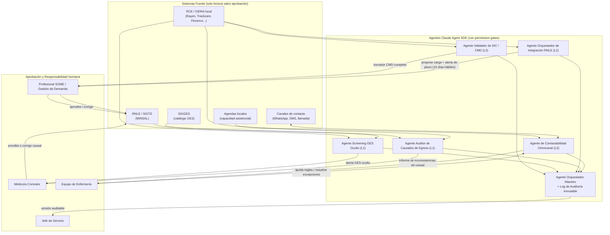

# 🤖 Piloto de Agentes de IA para la Automatización de la Burocracia Administrativa en la Gestión de Listas de Espera (Claude Agent SDK)

> **Complementa a:** [`EPIDEMIOLOGIA_GOBERNANZA_LISTAS_ESPERA_CHILE.md`](./EPIDEMIOLOGIA_GOBERNANZA_LISTAS_ESPERA_CHILE.md) (marco normativo y flujo RNLE), [`ECICEP_MODELO_TECNICO_OPERATIVO.md`](./ECICEP_MODELO_TECNICO_OPERATIVO.md) (modelo clínico), [`ESPECIFICACION_BASES_DATOS_Y_FUENTES.md`](./ESPECIFICACION_BASES_DATOS_Y_FUENTES.md) (motor de priorización) e [`IMPACTO_REPRIORIZACION_LISTAS_ESPERA_DM2.md`](./IMPACTO_REPRIORIZACION_LISTAS_ESPERA_DM2.md) (impacto clínico proyectado).
>
> **Diferencia de enfoque:** los documentos anteriores abordan la **priorización clínica** del paciente dentro de la lista. Este documento aborda el problema distinto y complementario de la **fricción administrativa entre sistemas** (SIGGES, SIGTE, RNLE, RCE/SIDRA, FONASA, agendas) que hoy consume tiempo profesional, retrasa el ingreso válido a la lista y genera egresos indebidos — el "cuello de botella burocrático" que antecede y rodea a la priorización clínica.

---

## 1. Resumen Ejecutivo

El Sistema Nacional de Servicios de Salud (SNSS) gestiona la demanda no resuelta a través de una arquitectura de sistemas heterogéneos y desconectados entre sí: **SIGGES** (garantías GES), **SIGTE/RNLE** (No GES), **RCE/SIDRA** u otros sistemas de ficha clínica electrónica homologados (Rayen, Trackcare, Florence, Avis-SIS), agendas locales y canales de contacto con el paciente. La Norma Técnica N° 118 (Res. Ex. N° 03, enero 2025) exige que la validación de una Solicitud de Interconsulta (SIC), su Conjunto Mínimo de Datos (CMD), su paso por Contraloría Médica y su carga al RNLE ocurran dentro de plazos administrativos estrictos (máximo 10 días hábiles), pero esta cadena depende hoy de trabajo manual de digitación, verificación cruzada y reingreso de datos entre sistemas que no conversan entre sí de forma nativa.

Este documento propone un **piloto acotado, de bajo riesgo clínico y alto impacto operativo**: un conjunto de **agentes de software construidos sobre el Claude Agent SDK** que automatizan tareas administrativas de **validación, integración, trazabilidad y contactabilidad** entre sistemas — sin sustituir el juicio clínico ni las decisiones médico-administrativas, que permanecen siempre bajo aprobación humana (Médico Contralor / Jefe de Servicio / SOME), conforme exige la normativa vigente.

El objetivo del piloto **no es repriorizar pacientes** (eso ya está cubierto por el motor ECICEP descrito en los documentos previos), sino **eliminar la latencia y el error administrativo** que hoy retrasa el ingreso correcto de un paciente a la lista, su egreso correcto de ella, y su contacto oportuno — condiciones previas indispensables para que cualquier priorización clínica tenga efecto real.

---

## 2. Problema: la Burocracia Administrativa como Cuello de Botella Silencioso

A partir del marco descrito en `EPIDEMIOLOGIA_GOBERNANZA_LISTAS_ESPERA_CHILE.md`, se identifican cinco fricciones administrativas concretas, cada una hoy resuelta por trabajo manual de digitadores, SOME o Contraloría Médica:

| # | Fricción Administrativa Actual | Sistema(s) Involucrados | Consecuencia Documentada |
| --- | --- | --- | --- |
| 1 | Verificación manual de completitud del CMD (Conjunto Mínimo de Datos) antes de que la SIC llegue a Contraloría Médica. | RCE/SIDRA → Contraloría Médica | Causal de devolución **"14. No Pertinencia"** o rechazo por incompletitud diagnóstica; el paciente vuelve a APS y reinicia el ciclo. |
| 2 | Detección de "GES oculto" (SIC No GES que en realidad corresponde a un problema GES vigente). | SIC → SIGGES | Si no se detecta a tiempo, el paciente pierde la garantía legal de oportunidad y queda mal clasificado en el régimen No GES. |
| 3 | Carga e integración de la SIC validada al RNLE dentro del plazo normado de **10 días hábiles**. | RCE/SIDRA → RNLE (MINSAL) | Incumplimiento del plazo genera **subregistro** y sesga las estadísticas oficiales (Glosa 06, DEIS) que se usan para asignar recursos. |
| 4 | Clasificación y acreditación documental de **causales de egreso** (Ord. C202 N° 2760 / NT 118): Atención Realizada, Inasistencia, Contacto No Corresponde, No Beneficiario, etc. | RNLE ↔ Ficha Clínica ↔ FONASA | Auditorías cualitativas (ver sección 5 de `EPIDEMIOLOGIA_...md`) advierten sobre el riesgo de **egresos administrativos indebidos** de pacientes vulnerables o ilocalizables bajo causales como "11. Contacto No Corresponde". |
| 5 | Gestión omnicanal de contactabilidad (WhatsApp/SMS/llamada) y clasificación de respuestas del paciente para confirmar, rechazar o reagendar citas. | Canales de mensajería → Agenda local | Alto costo en horas-persona de enfermería/SOME; reintentos no siempre documentados, afectando la trazabilidad exigida por la NT 118. |

Estas cinco fricciones son **tareas de orquestación de información entre sistemas y documentos**, no de diagnóstico clínico. Son, por definición, el tipo de tarea que un agente de software con acceso a herramientas (lectura/escritura de sistemas, generación de documentos, clasificación de texto) puede automatizar con supervisión humana, minimizando el riesgo regulatorio y de responsabilidad médico-legal.

---

## 3. Marco Normativo Vigente Aplicable al Piloto (Chile, agosto 2026)

Un piloto que automatiza el tránsito de datos de salud entre sistemas estatales y privados no puede diseñarse sin anclarse expresamente a la normativa vigente. La siguiente tabla consolida el marco aplicable, verificado a la fecha de este informe:

| Norma | Materia | Relevancia Directa para el Piloto | Estado (ago. 2026) |
| --- | --- | --- | --- |
| **Ley N° 19.966** (GES/AUGE) | Garantías Explícitas en Salud: Acceso, Oportunidad, Protección Financiera, Calidad. | Fundamenta el chequeo de "GES oculto" que el agente debe señalar (nunca decidir) antes de que una SIC ingrese al régimen No GES. | Vigente. |
| **Norma Técnica N° 118 / Res. Exenta N° 03 (enero 2025)** | Registro Nacional de Listas de Espera (RNLE): CMD exigible, plazo de integración de 10 días hábiles, causales oficiales de egreso. | Es el **estándar operativo central** que el agente de integración RNLE debe cumplir y cuyo incumplimiento debe alertar de forma proactiva. | Vigente. |
| **Ley N° 20.584** (Derechos y Deberes del Paciente) | Confidencialidad de la ficha clínica, consentimiento informado, acceso a la información de salud. | Todo agente que lea o escriba en la ficha clínica debe operar bajo las mismas reglas de confidencialidad y trazabilidad que un funcionario humano; ningún acto médico-administrativo puede quedar sin responsable humano identificado. | Vigente. |
| **Ley N° 21.668** (Interoperabilidad de Fichas Clínicas, publicada 28-05-2024) | Obliga a la interoperabilidad de la ficha clínica entre prestadores públicos y privados, bajo estándares definidos por MINSAL. | Es el **habilitante legal más directo** del piloto: da respaldo normativo expreso a que agentes orquesten el intercambio de datos clínicos entre sistemas distintos, siempre que se respeten los estándares MINSAL de interoperabilidad. | Vigente. |
| **Ley N° 21.180** (Transformación Digital del Estado) | Principios de interoperabilidad, equivalencia funcional, fidelidad y cooperación entre sistemas del Estado. | Obliga a que la integración entre RCE local, RNLE y SIGGES use estándares abiertos y trazables — exactamente el rol de los conectores del agente orquestador (sección 6.3). | Vigente desde jun-2022. |
| **Ley N° 21.719** (Protección de Datos Personales, publicada 13-12-2024) | Nueva Agencia de Protección de Datos, derechos ARCO reforzados, notificación de brechas en 72 h, base de licitud del tratamiento, Delegado de Protección de Datos (DPO). | El piloto trata **datos de salud (categoría especial)**: requiere Evaluación de Impacto en Protección de Datos (EIPD/DPIA), minimización de datos en los prompts/logs de los agentes, y diseño *privacy by design* **antes** de su entrada en vigencia. | **Entra en vigencia el 01-12-2026** — a solo meses del piloto propuesto; el diseño debe ser compatible desde el día uno. |
| **Ley N° 21.663** (Marco de Ciberseguridad, promulgada abr-2024, artículos clave vigentes desde mar-2025) | Obligaciones de gestión de riesgo, continuidad operacional, reporte de incidentes a la ANCI (Agencia Nacional de Ciberseguridad) para Operadores de Importancia Vital / Instituciones Públicas. | Un Servicio de Salud puede calificar como OIV; el proveedor de IA (Anthropic/Claude) y la integración con RNLE/SIGGES deben tratarse como **cadena de suministro crítica**: due diligence de proveedor, cifrado en tránsito/reposo, plan de continuidad si el servicio de agentes falla. | Vigente (artículos clave desde mar-2025). |
| **Ley N° 20.285** (Transparencia) | Acceso a información pública, incluida vía solicitud de microdatos del RNLE/SIGTE. | Los registros de auditoría generados por los agentes (ver sección 7) deben ser exportables y consistentes con las obligaciones de transparencia ya vigentes para el RNLE. | Vigente. |

**Lectura estratégica para el informe:** el piloto llega en una ventana regulatoria favorable — la Ley 21.668 (interoperabilidad de fichas clínicas) ya habilita legalmente el intercambio de datos entre sistemas, mientras que la Ley 21.719 entra en vigencia recién en diciembre de 2026. Esto significa que **diseñar el piloto ahora, bajo un esquema de cumplimiento anticipado (privacy by design + auditoría inmutable + human-in-the-loop)**, posiciona al proyecto como referente de cumplimiento en vez de tener que remediar deuda regulatoria después.

---

## 4. Principio de Diseño No Negociable: Automatizar el Trámite, No la Decisión

Para que el piloto sea legalmente defendible y clínicamente seguro, se fija un principio de diseño transversal, coherente con la matriz de roles ya definida en `README.md`:

> **Ningún agente ejecuta de forma autónoma un acto que la normativa exige atribuir a un profesional responsable identificado** (Médico Contralor, Jefe de Servicio, profesional SOME). Los agentes **preparan, verifican, alertan y proponen**; el humano **aprueba, firma y asume la responsabilidad** del acto administrativo o clínico.

Esto se traduce en tres niveles de autonomía, mapeados a cada agente en la sección 6:

| Nivel | Descripción | Ejemplo |
| --- | --- | --- |
| **L1 — Solo lectura / diagnóstico** | El agente lee datos de múltiples sistemas y genera un informe o alerta. No escribe en ningún sistema oficial. | Detección de posible "GES oculto" para revisión del Médico Contralor. |
| **L2 — Borrador asistido** | El agente redacta o completa un documento/registro, pero requiere aprobación humana explícita antes de enviarse o guardarse en el sistema oficial. | Completitud de CMD de una SIC antes de enviarla a Contraloría Médica. |
| **L3 — Ejecución supervisada con aprobación por lote** | El agente ejecuta una acción operativa de bajo riesgo (reenvío de recordatorio, reintento de contacto) dentro de reglas de negocio pre-aprobadas por el equipo clínico, con registro inmutable y posibilidad de reversión. | Envío de recordatorio de cita por WhatsApp según ventana de agendamiento ya definida por Enfermería. |

---

## 5. Por Qué Claude Agent SDK

El Claude Agent SDK (Anthropic) expone el mismo motor de agentes que impulsa Claude Code: un ciclo de herramientas (*tool-use loop*), gestión de contexto, sistema de permisos configurable y orquestación de subagentes especializados. Para este piloto es relevante porque permite modelar exactamente el principio de la sección 4 como parte de la arquitectura, no como una capa añadida después:

* **Sistema de permisos granular:** cada agente puede restringirse a un conjunto explícito de herramientas (p. ej. "leer RCE", "leer catálogo GES", "escribir borrador de SIC") y requerir aprobación humana (*permission gate*) antes de cualquier acción de escritura en un sistema oficial — esto materializa directamente los niveles L1/L2/L3 de la sección 4.
* **Subagentes especializados con contexto acotado:** cada fricción administrativa de la sección 2 se implementa como un subagente independiente con un alcance de datos mínimo (principio de minimización exigido por la Ley 21.719), en vez de un único modelo con acceso total a todos los sistemas.
* **Hooks de auditoría:** el SDK permite interceptar y registrar cada llamada a herramienta antes/después de su ejecución, lo que provee de forma nativa el **log inmutable y trazable** que exige tanto la NT 118 (versionado de la lista) como la Ley 20.584 (trazabilidad de la ficha clínica) y la Ley 21.719 (rendición de cuentas del tratamiento de datos).
* **Conectores a sistemas externos (MCP):** los sistemas locales (RCE/SIDRA, agendas) y las bases MINSAL (RNLE, SIGGES) se integran como fuentes de herramientas independientes, lo que permite evolucionar o reemplazar un conector sin rediseñar el agente completo — clave dado que la interoperabilidad entre HIS locales y RNLE (Ley 21.668, Ley 21.180) es un objetivo en construcción a nivel nacional, no un estándar cerrado.
* **Ejecución desacoplada del despliegue clínico:** los agentes administrativos pueden pilotarse en un entorno acotado (uno o dos CESFAM, una especialidad) sin tocar el motor de priorización clínica ECICEP ya especificado, reduciendo el radio de impacto regulatorio del piloto.

---

## 6. Arquitectura Propuesta del Piloto

### 6.1 Agente Validador de SIC / CMD (L2)

* **Función:** antes de que una Solicitud de Interconsulta llegue a Contraloría Médica, revisa contra el Conjunto Mínimo de Datos exigido por la NT 118 (identificación, antecedentes, diagnóstico CIE, motivo de derivación, exámenes previos de nivel primario) y redacta un borrador de SIC corregido o una lista de faltantes.
* **Impacto esperado:** reducción de la tasa de devolución por "**No Pertinencia**" o incompletitud, que hoy obliga al paciente a reiniciar el ciclo desde APS.
* **Aprobación:** el profesional de APS o SOME revisa y envía; el agente nunca envía directamente.

### 6.2 Agente de Screening "GES Oculto" (L1)

* **Función:** contrasta el diagnóstico presuntivo/confirmado de la SIC contra el catálogo vigente de 87 problemas de salud GES y señala (no decide) posibles coincidencias no detectadas.
* **Impacto esperado:** menor pérdida de garantías legales de oportunidad por mala clasificación temprana.
* **Aprobación:** el Médico Contralor confirma o descarta; solo él puede generar el traspaso formal a SIGGES (Causal 0).

### 6.3 Agente Orquestador de Integración RNLE (L2)

* **Función:** monitorea de forma continua el estado de cada SIC validada y su plazo de carga al RNLE (máximo 10 días hábiles), preparando el paquete de integración y alertando de forma temprana (a los 5-7 días) si el plazo está en riesgo.
* **Impacto esperado:** este es el agente de **impacto administrativo más medible y de menor riesgo regulatorio** del piloto — convierte un control manual/reactivo en un control proactivo casi en tiempo real, reduciendo el subregistro que hoy distorsiona las cifras oficiales de Glosa 06 y DEIS.
* **Aprobación:** SOME/Gestión de la Demanda aprueba la carga final.

### 6.4 Agente Auditor de Causales de Egreso (L1)

* **Función:** implementa de forma sistemática la recomendación metodológica ya identificada en `EPIDEMIOLOGIA_GOBERNANZA_LISTAS_ESPERA_CHILE.md` (sección 5, "Auditoría Cualitativa de Causales de Salida"): contrasta el respaldo documental exigido por cada causal (Ord. C202 N° 2760, NT 118) contra la ficha clínica, y **marca para revisión humana** (no revierte por sí mismo) los egresos administrativos —especialmente Causal 8 (Inasistencia) y Causal 11 (Contacto No Corresponde)— que carecen de bitácora de intentos de contacto completa, protegiendo a pacientes vulnerables o de difícil ubicación de un egreso indebido.
* **Impacto esperado:** mejora la calidad y defendibilidad del RNLE ante auditorías, y reduce el riesgo de vulneración de derechos de pacientes vulnerables.
* **Aprobación:** Médico Contralor acredita o corrige la causal.

### 6.5 Agente de Contactabilidad Omnicanal (L3)

* **Función:** ejecuta, dentro de reglas de negocio pre-aprobadas por Enfermería (ventanas de agendamiento, límites de cancelación, número máximo de reintentos), el envío de recordatorios y la clasificación NLP de las respuestas del paciente (Confirmado / Rechazado / Reagendar / Sin respuesta), liberando el cupo automáticamente solo cuando la regla lo permite explícitamente.
* **Impacto esperado:** reducción de horas-persona de Enfermería/SOME dedicadas a triage manual de mensajes, y trazabilidad completa de cada intento (insumo directo para el Agente Auditor de Causales, 6.4).
* **Aprobación:** reglas pre-aprobadas por Enfermería; excepciones escaladas a un humano.

### 6.6 Agente Orquestador Maestro y Log de Auditoría

* **Función:** coordina la secuencia entre agentes, aplica el sistema de permisos (bloquea cualquier escritura L2/L3 sin aprobación registrada) y mantiene el **log de auditoría inmutable** (quién — humano o agente —, qué, cuándo, con qué justificación), generando la versión auditable exigida en el flujo de aprobación ya definido en `README.md` (sección 4).

---

## 7. Alcance y Duración del Piloto

Se recomienda acotar el piloto a un territorio y un flujo administrativo ya caracterizados en el resto del repositorio, para reutilizar el contexto epidemiológico y de datos ya construido:

* **Territorio sugerido:** Servicio de Salud Metropolitano Sur Oriente (SSMSO), red de CESFAM + Hospital Dr. Sótero del Río (mismo territorio de `IMPACTO_REPRIORIZACION_LISTAS_ESPERA_DM2.md`).
* **Flujo administrativo piloto:** Consultas Nuevas de Especialidad (CNE) derivadas desde el PSCV/ECICEP hacia Diabetología, Nefrología y Cirugía Vascular Periférica (los mismos nudos críticos ya documentados en `EPIDEMIOLOGIA_GOBERNANZA_LISTAS_ESPERA_CHILE.md`, sección 4).
* **Duración:** 6 meses, en 4 fases.

| Fase | Duración | Foco | Entregable Verificable |
| --- | --- | --- | --- |
| **1. Línea Base y Gobernanza** | Meses 1-2 | Medir manualmente (sin agentes) la tasa actual de devolución de SIC, el tiempo real de integración al RNLE y el volumen de egresos por Causal 8/11 en el flujo piloto. Constituir comité de gobernanza (Contraloría Médica, SOME, Jefatura, DPO/encargado de protección de datos). Realizar la Evaluación de Impacto en Protección de Datos (EIPD) exigida de facto por la Ley 21.719. | Línea base cuantitativa + EIPD aprobada por el comité. |
| **2. Implementación Acotada (L1/L2)** | Meses 2-4 | Desplegar los Agentes 6.1, 6.2 y 6.3 (validación CMD, GES oculto, integración RNLE) en modo asistido, con aprobación humana obligatoria en el 100% de los casos. | Reducción medible del tiempo de preparación de la SIC y del riesgo de incumplimiento del plazo de 10 días hábiles. |
| **3. Extensión a Auditoría y Contactabilidad (L1/L3)** | Meses 4-5 | Incorporar el Agente Auditor de Causales (6.4) y el Agente de Contactabilidad (6.5) bajo reglas pre-aprobadas. | Informe de auditoría de causales de egreso + reducción de horas-persona en triage de contactabilidad. |
| **4. Evaluación y Decisión de Escalamiento** | Mes 6 | Comparar línea base vs. resultado piloto; auditoría externa de cumplimiento normativo (Ley 21.719, Ley 21.663); decisión de escalar a otros CESFAM/especialidades o a la capa clínica ECICEP. | Informe final de impacto + recomendación de escalamiento al Servicio de Salud y MINSAL. |

---

## 8. Indicadores de Impacto (KPIs del Piloto)

A diferencia del impacto clínico ya cuantificado en `IMPACTO_REPRIORIZACION_LISTAS_ESPERA_DM2.md` (reducciones de amputaciones, diálisis, eventos cardiovasculares), los indicadores de este piloto son **operativos y administrativos**, medibles desde el primer mes y con menor incertidumbre metodológica:

| Indicador | Fórmula / Medición | Fuente | Meta al Mes 6 (referencial, a validar contra línea base) |
| --- | --- | --- | --- |
| **Tiempo de integración al RNLE** | Días hábiles entre validación de la SIC y carga efectiva al RNLE. | Log del Agente 6.3 vs. RNLE | Reducción a menos de 48 horas hábiles (vs. el máximo normado de 10 días hábiles, hoy frecuentemente al límite). |
| **Tasa de devolución de SIC por incompletitud/No Pertinencia** | N° de SIC devueltas / N° de SIC emitidas en el flujo piloto. | Contraloría Médica | Reducción respecto a la línea base medida en Fase 1 (sin valor de referencia previo publicado; se establece con la propia línea base). |
| **Tasa de "GES oculto" detectado antes del ingreso a RNLE** | N° de casos señalados y confirmados por Médico Contralor / N° de SIC No GES revisadas. | Agente 6.2 + Contraloría Médica | Aumento sostenido mes a mes (más detección temprana = menos pérdida de garantía GES). |
| **Egresos administrativos con bitácora de contacto incompleta (Causal 8/11)** | N° de egresos marcados por el Agente 6.4 con respaldo documental insuficiente / N° total de egresos bajo esas causales. | Agente 6.4 + auditoría de ficha clínica | Reducción sostenida; objetivo de mediano plazo: 0 egresos sin bitácora completa para pacientes de estrato G3/vulnerables. |
| **Horas-persona de Enfermería/SOME en triage manual de contactabilidad** | Horas registradas antes vs. después del Agente 6.5. | Registro de turnos / bitácora | Reducción liberando capacidad para atención directa. |
| **Cumplimiento de auditoría normativa** | Checklist de cumplimiento Ley 21.719 (EIPD, minimización, notificación de brechas) y Ley 21.663 (gestión de riesgo, reporte ANCI si aplica). | Comité de gobernanza / auditoría externa | 100% de los ítems del checklist cerrados antes del 01-12-2026 (entrada en vigencia de la Ley 21.719). |

---

## 9. Riesgos y Mitigaciones

| Riesgo | Descripción | Mitigación |
| --- | --- | --- |
| **Alucinación o error del modelo en tareas L1/L2** | El agente señala incorrectamente un "GES oculto" o completa mal un campo del CMD. | Ningún output se escribe en sistema oficial sin aprobación humana (principio de la sección 4); el agente siempre debe citar la fuente de datos exacta que sustenta su sugerencia. |
| **Egreso indebido automatizado** | Que el Agente 6.5 libere un cupo o el Agente 6.4 sugiera cerrar un caso sin respaldo suficiente. | Egresos y liberación de cupos de pacientes vulnerables (estrato G3, PRAIS, NNA bajo protección, adultos mayores dependientes) quedan siempre en nivel L1 (solo alerta), nunca en L3. |
| **Incumplimiento de la Ley 21.719 al entrar en vigencia (01-12-2026)** | El piloto queda diseñado con estándares de protección de datos insuficientes para diciembre de 2026. | Ejecutar la EIPD en la Fase 1 (no al final), minimizar datos personales en prompts/logs, y definir desde el diseño el flujo de notificación de brechas en 72 horas. |
| **Dependencia de un proveedor externo de IA para infraestructura crítica de salud** | Riesgo de continuidad si el servicio del proveedor falla, bajo la óptica de la Ley 21.663 (ciberseguridad de infraestructura crítica). | Plan de continuidad operacional que permita volver al flujo 100% manual sin pérdida de datos; cifrado en tránsito/reposo; cláusulas contractuales de residencia y confidencialidad de datos con el proveedor. |
| **Resistencia al cambio del equipo administrativo/clínico** | Percepción de amenaza al rol de Contraloría Médica o SOME. | Encuadre explícito del piloto como herramienta de **asistencia**, no reemplazo — reforzado por el propio diseño L1/L2/L3, que mantiene la firma humana en cada acto. |

---

## 10. Próximos Pasos Recomendados para el Informe

1. Validar con el Servicio de Salud/CESFAM piloto el acceso de solo lectura a RCE/RNLE necesario para medir la línea base de la Fase 1.
2. Constituir el comité de gobernanza (incluyendo un rol explícito de responsable de protección de datos) antes de tocar cualquier dato real de pacientes.
3. Ejecutar la Evaluación de Impacto en Protección de Datos (EIPD) como primer entregable formal, dado el plazo del 01-12-2026 de la Ley 21.719.
4. Priorizar el Agente 6.3 (Integración RNLE) como *quick win* del piloto: es el de menor riesgo clínico, mayor facilidad de medición y mayor alineación con una obligación normativa ya vigente e incumplida en la práctica (el plazo de 10 días hábiles).

---

## 11. Referencias

* Ley N° 19.966 — [Establece un Régimen de Garantías en Salud (GES/AUGE)](https://www.bcn.cl/leychile/navegar?idNorma=229834)
* Ley N° 20.584 — [Regula los Derechos y Deberes que tienen las Personas en relación con Acciones vinculadas a su Atención en Salud](https://www.bcn.cl/leychile/navegar?idNorma=1039348)
* Ley N° 20.285 — [Sobre Acceso a la Información Pública](https://www.bcn.cl/leychile/navegar?idNorma=276363)
* Ley N° 21.180 — [Transformación Digital del Estado](https://digital.gob.cl/transformacion-digital/ley-de-transformacion-digital/)
* Ley N° 21.668 — [Interoperabilidad de las Fichas Clínicas](https://www.minsal.cl/ley-de-interoperabilidad-de-fichas-clinicas-fue-publicada-en-el-diario-oficial/)
* Ley N° 21.663 — [Marco de Ciberseguridad e Infraestructura Crítica de la Información](https://www.bcn.cl/leychile/navegar?idNorma=1198185)
* Ley N° 21.719 — [Nueva Ley de Protección de Datos Personales (vigencia 01-12-2026)](https://www.bcn.cl/leychile/navegar?idNorma=1210644)
* Res. Exenta N° 03 (enero 2025), MINSAL — [Actualización Norma Técnica N° 118, Registro de Listas de Espera No GES](https://dis.saludoriente.cl/dis/docs/listas-de-espera/RES.%20EXENTA%20N%C2%B0%2003%20ACTUALIZACI%C3%93N%20DE%20NORMA%20DE%20REGISTRO%20LE%20NO%20GES,%20Norma%20tecnica%20118%20(enero%202025).pdf)
* Ordinario C202 N° 2760 (2021), MINSAL — [Causales de Salida de Lista de Espera No GES](https://estadisticas.ssosorno.cl/lista_espera/documentos_le/Ord_C202_N2760_Causales_de_Salida_de_LE_No_GES(08092021).pdf)
* Anthropic — [Claude Agent SDK](https://docs.claude.com/) (documentación oficial del SDK: sistema de permisos, subagentes y herramientas)
