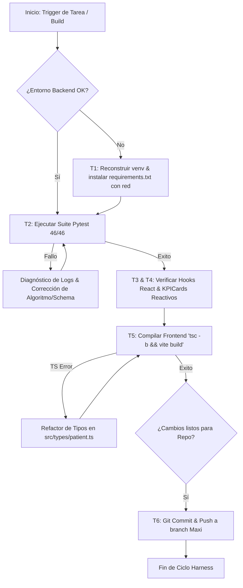

# Master Specification — System Execution Harness (Health OS)

> **Versión:** 1.0.0
> **Fecha:** 6 de Agosto de 2026
> **Producto:** Health OS — Sistema de Gestión de Lista de Espera APS
> **Certamen:** Impact Lab
> **Repositorio:** `vicentico/HealtImpactlab` (Branch: `Maxi`)
> **Clasificación:** Especificación Técnica de Arquitectura y Automatización

---

```yaml
system:
  name: Health OS Operational Execution Harness
  version: 1.0.0
  compliance: Ley 21.719 (Chile - Privacidad de Datos) & Norma Técnica 118 MINSAL (ECICEP)
  engine_target: FastAPI (Python 3.14) + React 18 (TypeScript) + Supabase (PostgreSQL)
  orchestration_mode: Deterministic Single-Threaded Pipeline (Non-Multi-Agent Sandbox)
```

---

## 1. Propósito y Alcance del Harness (Scope & Action Field)

El **Harness de Ejecución de Health OS** es la capa orquestadora determinista encargada de garantizar el ciclo de vida continuo (E2E), la integridad algorítmica, el cumplimiento legal de privacidad y la verificación de calidad del software sin sufrir por la sobrecarga de contexto ni degradación por multitarea multiagente.

### Campo de Acción:
* **Capa Algorítmica:** Validación y ejecución del Motor de Riesgo NT 118 (5 subcriterios: $C_1$ HbA1c, $C_2$ VFG, $C_3$ Complicaciones CV/Pie, $C_4$ Determinantes Sociales, $C_5$ Días en Lista).
* **Capa de Privacidad (Privacy by Design):** Ofuscación y hashing irreversible ($RUT \to \text{SHA-256 + Salt}$) previo a cualquier log o persistencia.
* **Capa de Persistencia e Integridad:** Bitácora inmutable (Append-Only) para la Contraloría Médica APS.
* **Capa E2E (Frontend/Backend):** Sincronización reactiva del cliente API React/Vite con la API REST FastAPI/Supabase.

---

## 2. Herramientas y Módulos de Integración (Tools & Capabilities)

El Harness opera interactuando con las siguientes herramientas de desarrollo, testing y automatización visual (incluyendo el ecosistema de Anthropic / MCP):

| Tool / API | Categoría | Función en el Harness |
|---|---|---|
| **Anthropic Computer Use** | Visual / UI Automation | Inspección visual de la interfaz React en navegador (verificación de Badges, Mapas de Presión APS y tablas renderizadas). |
| **Chrome DevTools MCP** | Inspección Web / A11y | Auditoría de DOM, accesibilidad (a11y), inspección de peticiones de red (`/api/pacientes`) y consumo de memoria JS. |
| **Playwright / Stealth Sandbox** | Automation | Pruebas de integración E2E sintéticas simulando el comportamiento del Médico Contralor en pantalla. |
| **Pytest Runner (Python)** | Test Unitario & Estrés | Ejecución de la suite determinista (46 tests de integración y estrés algorítmico). |
| **TypeScript Compiler (`tsc -b`)** | Verificación Estática | Validación estricta de tipos sin emisión de código (`noEmit`). |

---

## 3. Flujo de Ejecución y Árbol de Decisiones (Decision Tree)



### Esquema de Decisión Determinista:
1. **Regla de Cero Complacencia:** Si una prueba unitaria o de tipos falla, el Harness detiene inmediatamente el despliegue; prohibido silenciar tests o saltar compilación.
2. **Fallback Offline Directo:** Si el API Backend no responde en $\le 1500\text{ms}$, el Harness fuerza al Frontend a consumir el `fallbackPatientsStore` sintético para evitar pantallas en blanco.
3. **Evaluación de Riesgo NT 118:**
   $$\text{Score Total} = \min\left(100, \sum_{i=1}^{5} C_i\right)$$
   * $\text{Score} \ge 90 \implies \text{CRÍTICO (Badge Rojo + Alerta)}$
   * $\text{Score} \ge 75 \implies \text{ALTO}$
   * $\text{Score} \ge 50 \implies \text{MEDIO}$
   * $\text{Score} < 50 \implies \text{BAJO}$

---

## 4. Modelos Deterministas de Apoyo y Derivación

El Harness **no delega lógica matemática o clínica a modelos de lenguaje (LLMs)**. Los LLMs solo estructuran intenciones o generan UI; la lógica de negocio es 100% determinista:

* **Motor NT 118 (`backend/app/engine/nt118.py`):** Algoritmo matemático puro basado en rangos estrictos MINSAL.
* **Modelo de Anonymization (`backend/app/core/privacy.py`):**
  * `mask_rut(rut)` $\to$ Expresión regular que preserva los primeros dígitos y aplica `***` a los 3 penúltimos.
  * `hash_rut(rut)` $\to$ `HMAC-SHA256(RUT, RUT_SALT)`.
* **Mapeador Bidireccional (`src/services/api.ts`):** Transformación estricta entre `snake_case` (Backend) y `camelCase` (Frontend React).

---

## 5. Matriz de Límites: Qué Hace vs. Qué NO Hace

| Qué HACE el Harness | Qué NO HACE el Harness (Límites Estrictos) |
|---|---|
| ✅ Ejecutar la suite completa de pruebas unitarias e integración. | ❌ **No toma decisiones clínicas:** No aprueba ni rechaza solicitudes de contraloría por su cuenta. |
| ✅ Enmascarar y hashear PII en memoria y payloads de API. | ❌ **No inventa reglas de priorización:** Se ciñe strictly a la Norma Técnica 118 MINSAL. |
| ✅ Garantizar cero errores de compilación TypeScript/Vite. | ❌ **No procesa datos reales de pacientes:** Rechaza datasets que contengan RUTs reales no enmascarados. |
| ✅ Verificar reactividad de componentes UI y gráficos de presión. | ❌ **No realiza despliegues a producción (Vercel/Railway) sin aprobación:** Queda en estado Staging/Git. |

---

## 6. Puntos de Intervención Humana (Human-In-The-Loop — HITL)

El ser humano (Médico Contralor / Administrador de Salud / Arquitecto) interviene de forma obligatoria en los siguientes **3 puntos de control**:

1. **Resolución de Contraloría Médica (Overriding Clínico):**
   * El algoritmo prioriza automáticamente, pero el **médico humano** debe hacer clic en `APROBAR`, `RECHAZAR` o `DERIVAR` e ingresar su nota médica obligatoria para que el estado cambie.
2. **Aprobación de Cambios en la Ley de Privacidad / Requisitos:**
   * Si cambia una regulación (ej. Modificación a la Ley 21.719), un humano debe auditar y autorizar la modificación del algoritmo de ofuscación `privacy.py`.
3. **Autorización de Deploy a Producción:**
   * El Harness valida el build y hace push al repo (`Maxi`), pero la activación final de variables de entorno en Supabase/Vercel requiere la confirmación manual del equipo.
