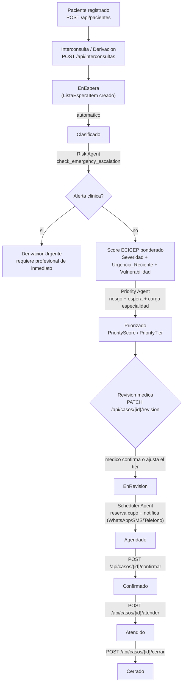

# MediSync-Diabetes — PoC

Prueba de concepto de un sistema multiagente de IA para descomprimir listas de espera de pacientes
diabeticos en el sistema publico chileno, mediante priorizacion inteligente alineada al Score de Criticidad
Real del modelo ECICEP (Risk Agent + Priority Agent), deteccion automatica de derivacion urgente, y
coordinacion automatica de agenda con notificacion omnicanal simulada (Scheduler Agent). Ver documentacion
completa en [docs/](docs/), empezando por [docs/00-resumen-ejecutivo.md](docs/00-resumen-ejecutivo.md).

## Flujo del sistema

Un caso recorre 10 etapas desde que un paciente es derivado hasta que su atencion queda cerrada. Las 3
primeras transiciones (clasificacion + evaluacion de riesgo + priorizacion) ocurren automaticamente y en
cadena dentro de la misma request de `POST /api/interconsultas`; el resto requiere una accion explicita
(un medico revisando el caso, o un llamado a los endpoints de agenda). Una excepcion a esta secuencia: si el
Risk Agent detecta una alerta clinica (sospecha IAM/ACV, crisis hiperglicemica, pie diabetico infectado, caida
brusca de VFG), el caso sale del flujo automatico y queda marcado para atencion inmediata de un profesional.



| # | Estado (`EstadoCaso`) | Que pasa | Quien/que lo dispara |
|---|---|---|---|
| 1 | — | Se registra el paciente (incluye vulnerabilidad: dependencia severa, ruralidad, determinantes sociales) | `POST /api/pacientes` |
| 2 | `EnEspera` | Se registra la interconsulta (HbA1c, glicemia, VFG, RAC, neuropatia, urgencias recientes, alertas clinicas) y se crea el `ListaEsperaItem` | `POST /api/interconsultas` |
| 3 | `Clasificado` | El caso queda formalmente en la lista de espera de la especialidad | Automatico (mismo request) |
| 4a | `Clasificado` → `DerivacionUrgente` | Si `check_emergency_escalation` detecta una alerta, el caso queda marcado y **no** avanza a Priorizado | Automatico — chequeo deterministico dentro del Risk Agent |
| 4b | `Clasificado` | **Risk Agent** calcula el Score de Criticidad Real ECICEP (`RiskScore`/`RiskLevel`) ponderando Severidad, Urgencia_Reciente y Vulnerabilidad | Automatico — agente IA (Claude) |
| 5 | `Priorizado` | **Priority Agent** calcula `PriorityScore`/`PriorityTier` (P1/P2/P3) combinando riesgo, dias en espera y carga de la especialidad | Automatico — agente IA (Claude) |
| 6 | `EnRevision` | Un medico revisa la sugerencia de la IA y la confirma o la ajusta; queda registrado si el origen final fue `IA` o `Humano` | `PATCH /api/casos/{id}/revision` |
| 7 | `Agendado` | **Scheduler Agent** reserva el cupo de agenda mas adecuado al tier confirmado y notifica al paciente por un canal simulado (WhatsApp/SMS/Telefono), con respuesta simulada (`Confirmado`/`Rechazado`/`SinRespuesta`) | Automatico (disparado por el paso anterior) — agente IA (Claude) |
| 8 | `Confirmado` | Se confirma la hora agendada | `POST /api/casos/{id}/confirmar` |
| 9 | `Atendido` | Se registra que el paciente fue atendido | `POST /api/casos/{id}/atender` |
| 10 | `Cerrado` | Se cierra el caso | `POST /api/casos/{id}/cerrar` |

En cualquier punto, `GET /api/casos/{id}` devuelve la trazabilidad completa del caso: riesgo, prioridad,
justificaciones generadas por cada agente, tool calls, tokens consumidos y el historial de eventos; y
`GET /api/kpis` agrega estos datos (casos activos/cerrados, derivaciones urgentes, distribucion por prioridad,
tasa de NSP), visible tambien en la pantalla `/kpis` del frontend. El detalle linea por linea (con una traza
real capturada contra la API de Anthropic) esta en [docs/05-flujo-secuencia.md](docs/05-flujo-secuencia.md);
la ficha de cada agente (objetivo, tools, prompt, fallback) esta en
[docs/04-agentes-ia.md](docs/04-agentes-ia.md); el analisis y las tareas detras del score ECICEP y la
derivacion urgente estan en [docs/08-analisis-ecicep-prompt.md](docs/08-analisis-ecicep-prompt.md).

## Stack

- Backend: .NET 10, Clean Architecture, CQRS/MediatR, FluentValidation
- IA: HttpClient propio hacia la Anthropic Messages API (`MediSync.AI`), sin SDK oficial (ver
  [docs/rustyhand-analisis.md](docs/rustyhand-analisis.md))
- Persistencia: MongoDB (Docker)
- Frontend: Angular 20, Standalone Components + Signals

## Requisitos

- .NET SDK 10+
- Docker (para MongoDB)
- Node 20+ y Angular CLI 20 (solo si vas a correr el frontend)
- Una API key de Anthropic (`ANTHROPIC_API_KEY`) — sin ella, el backend funciona pero los endpoints que
  invocan agentes IA devuelven `502` con el error real de Anthropic (no hay fallback simulado).

## Levantar el backend

```bash
# 1. Mongo (queda en localhost:27018, no 27017, para no chocar con otros proyectos locales)
docker compose up -d

# 2. Configurar la API key de Anthropic (no commitear secretos)
dotnet user-secrets init --project src/MediSync.Api
dotnet user-secrets set "Anthropic:ApiKey" "sk-ant-..." --project src/MediSync.Api

# 3. Correr la API (ASPNETCORE_ENVIRONMENT=Development es necesario para que se carguen los user-secrets)
ASPNETCORE_ENVIRONMENT=Development dotnet run --project src/MediSync.Api
# API en http://localhost:5182 (perfil "http" de src/MediSync.Api/Properties/launchSettings.json;
# el perfil "https" expone además https://localhost:7117)
```

Al arrancar, la API siembra automaticamente datos dummy (24 pacientes, 5 profesionales, 3 CESFAM, 2
hospitales, 2 especialidades, cupos de agenda) si las colecciones estan vacias — ver
`MediSync.Infrastructure/Seed/DummyDataSeeder.cs`.

## Probar el flujo completo (curl)

Ver el detalle linea por linea, con ejemplo real capturado, en
[docs/05-flujo-secuencia.md](docs/05-flujo-secuencia.md). Resumen:

```bash
curl http://localhost:5182/api/lista-espera

curl -X POST http://localhost:5182/api/pacientes -H "Content-Type: application/json" \
  -d '{"run":"11223344-5","nombre":"Juan Perez","fechaNacimiento":"1958-03-12","cesfamOrigenId":"cesfam-001"}'

curl -X POST http://localhost:5182/api/interconsultas -H "Content-Type: application/json" \
  -d '{"pacienteId":"<id>","especialidadId":"diabetologia","motivo":"HbA1c elevada","hbA1c":9.2,"glicemiaAyunas":180,"comorbilidades":["Hipertension"]}'

curl http://localhost:5182/api/casos/<listaEsperaItemId>

curl -X PATCH http://localhost:5182/api/casos/<listaEsperaItemId>/revision -H "Content-Type: application/json" \
  -d '{"aprobadoPor":"Dr. Gonzalez","prioridadConfirmada":"P1"}'

curl -X POST http://localhost:5182/api/casos/<listaEsperaItemId>/confirmar
curl -X POST http://localhost:5182/api/casos/<listaEsperaItemId>/atender
curl -X POST http://localhost:5182/api/casos/<listaEsperaItemId>/cerrar

curl http://localhost:5182/api/kpis
```

## Levantar el frontend

```bash
cd frontend/medisync-web
npm install
ng serve   # http://localhost:4200 (CORS ya habilitado en MediSync.Api para este origen)
```

Pantallas: lista de espera (`/`), ingreso de paciente (`/ingreso`), detalle/trazabilidad de un caso
(`/casos/:id`) y KPIs (`/kpis`).

## Estructura del repo

Ver [docs/02-arquitectura.md](docs/02-arquitectura.md) para el detalle de capas y decisiones. Resumen:

```
src/MediSync.Domain           Entidades DDD
src/MediSync.Application      Casos de uso (CQRS/MediatR)
src/MediSync.AI                AgentLoop + 3 agentes + tools + manifiestos
src/MediSync.Infrastructure    MongoDB (documentos, repos, seed)
src/MediSync.Api               Minimal API
frontend/medisync-web          Angular 20
dummy-data/                    JSON de datos de referencia para el seeder
docs/                          Especificacion tecnica completa
```
