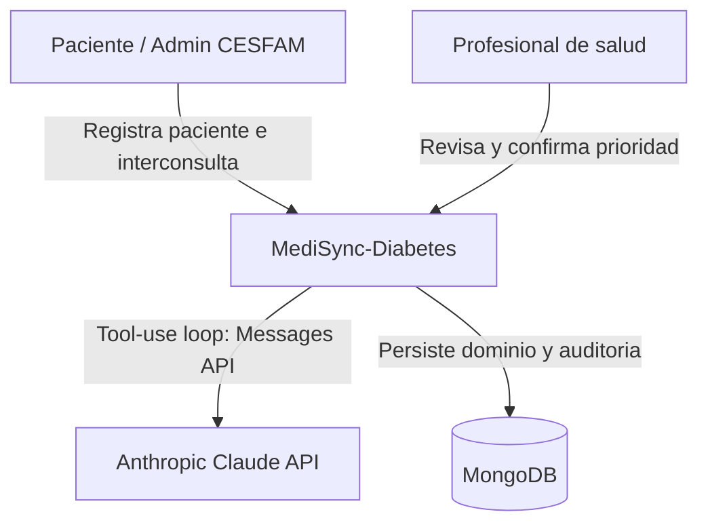
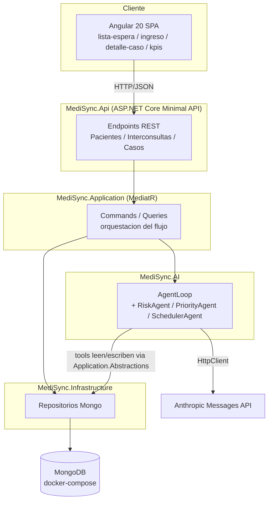

# 02. Arquitectura

## Principios aplicados

- **Clean Architecture**: `Domain` no depende de nada; `Application` depende solo de `Domain`;
  `Infrastructure` y `AI` dependen de `Application`; `Api` depende de las tres capas de abajo.
- **CQRS** con MediatR: cada caso de uso es un `Command`/`Query` + `Handler` en `MediSync.Application`.
- **Result Pattern**: transiciones de estado (`ListaEsperaItem.TransicionarA`) devuelven `Result` en vez de
  lanzar excepciones para errores de negocio esperables.
- **Repository Pattern**: `Application` solo conoce interfaces (`IPacienteRepository`, etc.); las
  implementaciones concretas de MongoDB viven en `Infrastructure`.
- **Vertical slice donde conviene**: cada modulo de dominio (`Pacientes`, `Interconsultas`, `ListaEspera`,
  `Priorizacion`, `Agenda`, `Auditoria`) tiene su propia carpeta espejada en Domain/Application/Infrastructure,
  en vez de organizar por tipo tecnico.
- **Puerto/adaptador para IA**: `Application` define `IRiskAgent`, `IPriorityAgent`, `ISchedulerAgent` (en
  `Abstractions/IAgents.cs`); `MediSync.AI` los implementa llamando a Anthropic. Si mañana se reemplaza el
  motor de IA (p.ej. por un sidecar con el Claude Agent SDK oficial en Node), solo cambia `MediSync.AI` — el
  dominio y los casos de uso no se tocan.

## C4 — Nivel 1: Contexto



## C4 — Nivel 2: Contenedores



## Capas y carpetas reales

```
src/
  MediSync.Domain/          Entidades DDD, value objects, Result, sin dependencias externas
  MediSync.Application/     CQRS (MediatR), interfaces de repos y agentes, ValidationBehavior
  MediSync.AI/               AnthropicClient, AgentLoop, AgentManifest, Tools/, Agents/, Manifests/*.json
  MediSync.Infrastructure/  MongoContext, Documents/ (DTOs de persistencia), Repositories/, Seed/
  MediSync.Api/              Program.cs, Endpoints/
frontend/medisync-web/       Angular 20 standalone (lista-espera, ingreso-paciente, detalle-caso, kpis)
```

## Decision clave: documentos de persistencia separados del dominio

Durante la implementacion se intento mapear las entidades de dominio (con constructores privados/internos
para proteger invariantes) directamente a MongoDB usando `BsonClassMap.MapCreator`. El driver de MongoDB
resolvio mal el constructor a usar (`BsonSerializationException: Creator map ... has 5 arguments, but none
are configured`), un problema real de ambiguedad entre el constructor de negocio y el de rehidratacion.

**Decision**: `MediSync.Infrastructure.Persistence.Documents` define POCOs de persistencia (constructor
publico sin parametros, propiedades publicas) — uno por entidad — con funciones de mapeo explicitas
(`ToDocument()` / `ToDomain()`) en el mismo archivo. Es mas codigo que dejar que el driver infiera todo, pero
es 100% predecible y mantiene el dominio libre de anotaciones de persistencia (Clean Architecture: el
dominio no sabe que existe MongoDB). Las entidades de dominio exponen constructores `internal` de
rehidratacion (visibles solo para `MediSync.Infrastructure` via `InternalsVisibleTo`, ver
`MediSync.Domain/AssemblyInfo.cs`) que los mappers usan para reconstruir el objeto completo, incluyendo
estado que normalmente solo cambia via metodos de negocio (p.ej. `Estado` en `ListaEsperaItem`).

## Observabilidad implementada

- **Correlation id por ejecucion de agente**: cada `AgentExecutionLog` tiene su propio `CorrelationId`.
- **Timeline de eventos**: `CasoEvento` registra cada transicion relevante del caso con timestamp.
- **Decision log**: `DecisionLog` distingue explicitamente decisiones de origen `IA` vs `Humano` (clave para
  la revision medica: si el medico confirma la sugerencia de la IA sin cambios, el origen registrado sigue
  siendo `IA`; si la ajusta, se registra `Humano`).
- **Metricas de costo/uso real**: cada `AgentExecutionLog` guarda `Iteraciones`, `TokensEntrada` y
  `TokensSalida` devueltos por la Anthropic Messages API — permite verificar que el agente realmente iteró
  con tool-use y no devolvio una respuesta enlatada.
