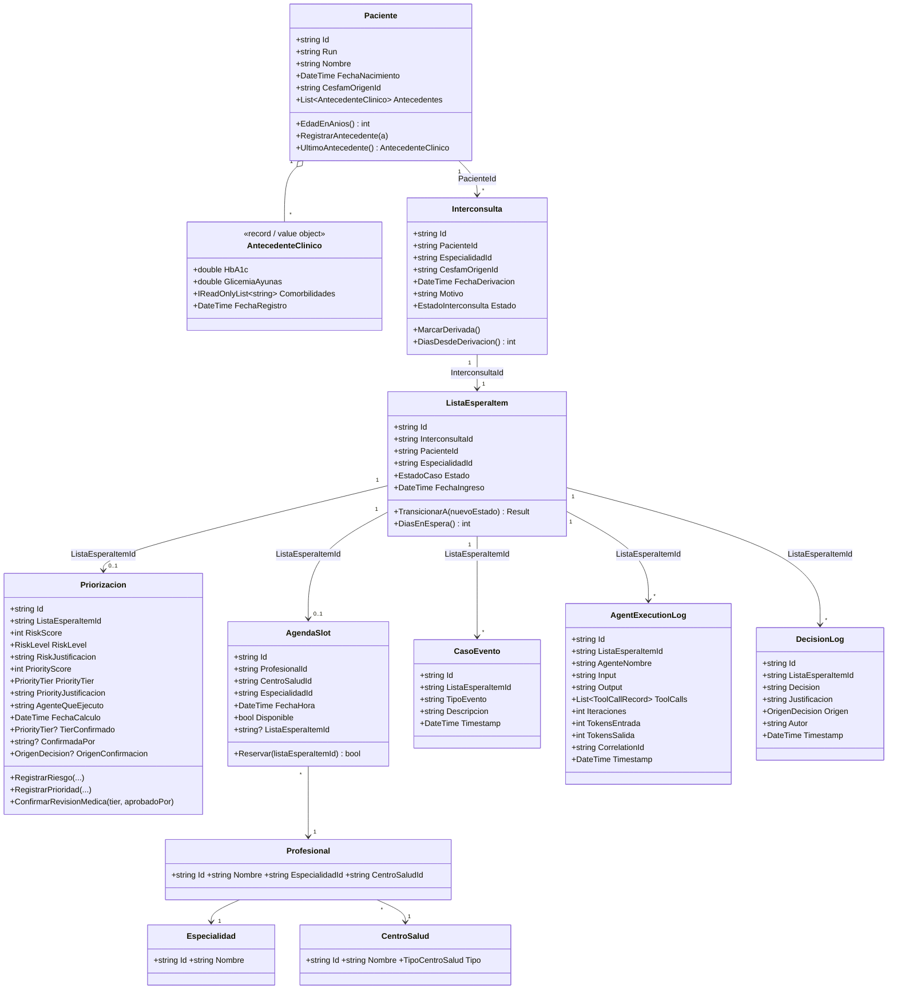
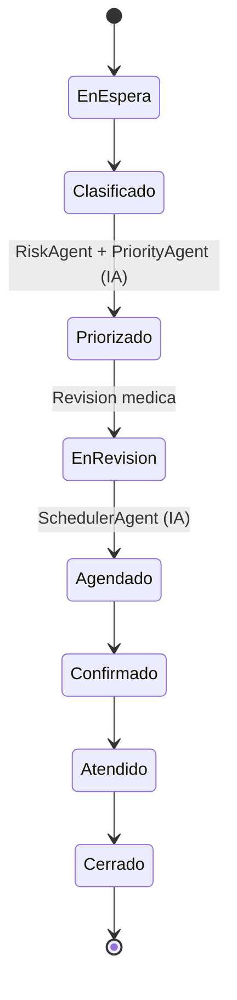

# 03. Modelo de dominio

Subconjunto del modelo DDD completo (ver `../claude.md`), acotado a lo necesario para el flujo minimo de la
PoC. Namespace raiz: `MediSync.Domain`.

## Maquina de estados de `ListaEsperaItem`

`EstadoCaso` es una secuencia estrictamente lineal (ver `ListaEsperaItem.TransicionesPermitidas`):

Cualquier intento de transicion fuera de esta secuencia devuelve `Result.Failure` en vez de lanzar una
excepcion (p.ej. no se puede confirmar un caso que aun esta `EnEspera`).

## Notas de diseño

- **Enums en vez de tablas de catalogo para estados**: `EstadoCaso`, `RiskLevel`, `PriorityTier`,
  `OrigenDecision` son enums C# — para una PoC evita una capa de configuracion extra; si el catalogo de
  estados necesitara cambiar en runtime (multi-tenant, distintos protocolos por region), se migrarian a
  colecciones de referencia en Mongo.
- **`PriorityTier.P1` es el valor `0` del enum** — esto genero un bug real durante el desarrollo: un caso
  cuyo pipeline de IA fallo a medio camino (antes de calcular la prioridad) se veia con `PriorityTier=P1` por
  el valor por defecto, en vez de "sin priorizar". Se corrigio en la capa de consulta
  (`ListarListaEsperaQuery`/`ObtenerCasoQuery`), que ahora solo expone el tier cuando el `ListaEsperaItem`
  efectivamente alcanzo el estado `Priorizado` o posterior. Ver [05-flujo-secuencia.md](05-flujo-secuencia.md)
  para el detalle de por que esto importa en la demo.
- **`AntecedenteClinico` y `ToolCallRecord` son `record`s inmutables** — value objects sin identidad propia,
  embebidos en `Paciente.Antecedentes` y `AgentExecutionLog.ToolCalls` respectivamente.
- Fuera de este modelo (documentado como pendiente en [07-roadmap-futuro.md](07-roadmap-futuro.md)):
  `Contrarreferencia` como entidad completa, `Conversation`/`Memory` persistente entre sesiones de agente
  (cada ejecucion de agente en esta PoC es efimera, acotada al caso), `Tool Call` como coleccion propia
  (aqui se embebe dentro de `AgentExecutionLog`).
