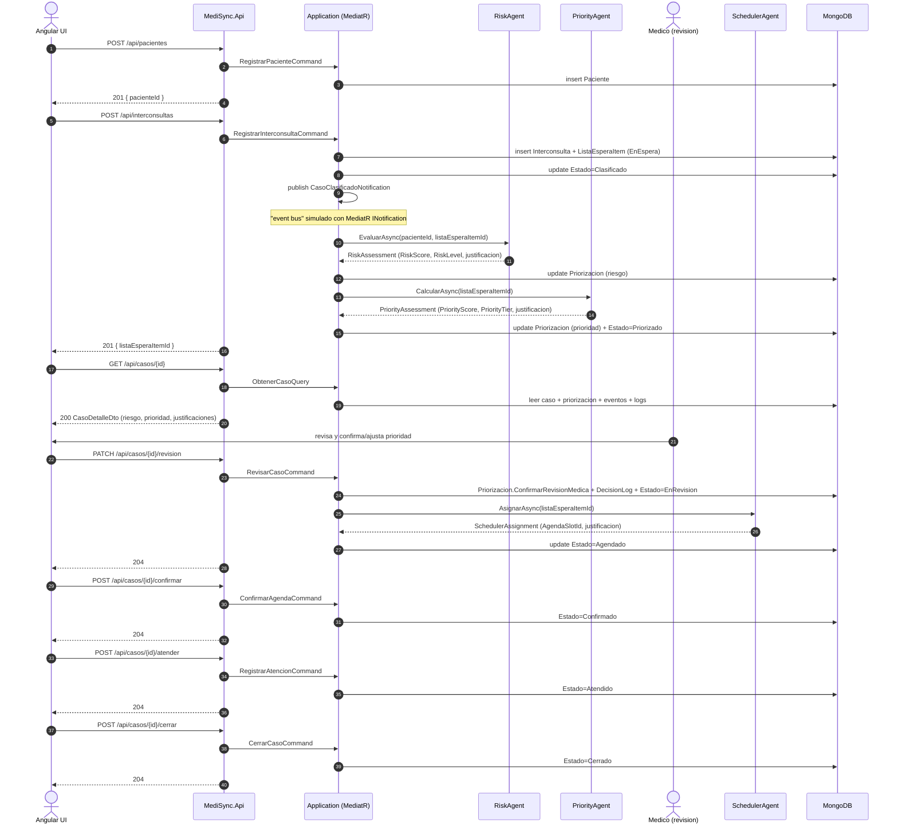
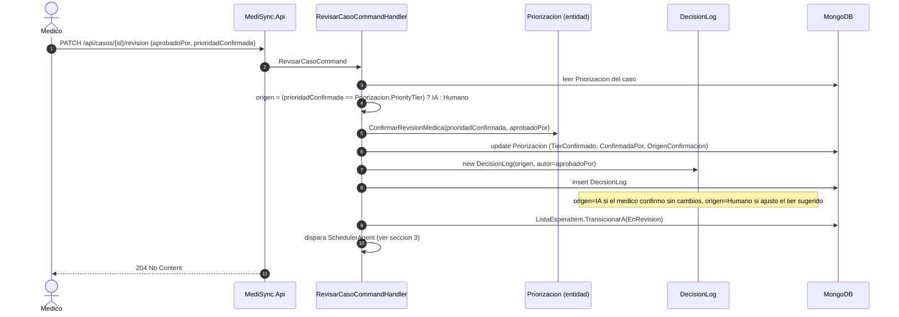

# 05. Flujo de la PoC — Diagramas de secuencia

Los 4 diagramas de esta seccion reflejan el codigo tal como quedo implementado (nombres de clases, endpoints,
tools y colecciones reales), no un diseño aspiracional. Fueron validados corriendo el flujo completo contra
una API de Anthropic real (ver la traza de ejemplo al final de cada seccion relevante).

> **Nota (ECICEP):** el diagrama 1 muestra `App->>Risk: EvaluarAsync(...)` como una sola llamada — sigue
> siendo correcto a ese nivel, pero desde la incorporacion del Score de Criticidad Real ECICEP el Risk Agent
> hace internamente un paso adicional (`check_emergency_escalation`, antes de razonar el score ponderado) que
> puede terminar el flujo en `DerivacionUrgente` en vez de continuar a Priorizado. El detalle tool-por-tool de
> ese paso, y el ejemplo de traza real de la formula ponderada, estan en
> [04-agentes-ia.md](04-agentes-ia.md) y [08-analisis-ecicep-prompt.md](08-analisis-ecicep-prompt.md); no se
> re-dibujaron los 4 diagramas de esta pagina para no duplicar esa documentacion.

## Indice

- [1. Flujo end-to-end completo](#1-flujo-end-to-end-completo)
- [2. Tool-use loop de un agente (Priority Agent como referencia)](#2-tool-use-loop-de-un-agente-priority-agent-como-referencia)
- [3. Agenda y confirmacion (Scheduler Agent)](#3-agenda-y-confirmacion-scheduler-agent)
- [4. Revision medica (aprobacion humana sobre sugerencia IA)](#4-revision-medica-aprobacion-humana-sobre-sugerencia-ia)
- [Como se verifico este flujo](#como-se-verifico-este-flujo-no-solo-se-diseño)

---

## 1. Flujo end-to-end completo

Cubre las 10 etapas: Paciente -> Derivacion -> Lista de espera -> Clasificacion -> Priorizacion IA ->
Revision medica -> Agenda -> Confirmacion -> Atencion -> Cierre.



### Traza real capturada durante el desarrollo

Caso `82566e31cd854b6fbc3de98f17c76874` (paciente de 68 años, HbA1c 9.2%, glicemia 180, hipertenso):

1. `POST /api/interconsultas` -> `201 { listaEsperaItemId }` (la respuesta ya incluye el id, la
   clasificacion + calculo de riesgo/prioridad ocurren de forma sincrona dentro de la misma request en esta
   PoC, aunque estan desacoplados via `INotification`/`ISender`).
2. `GET /api/casos/{id}` mostro `RiskLevel=Alto (score 75)` y `PriorityTier=P1 (score 85)`, cada uno con una
   justificacion distinta generada por el modelo, citando los valores clinicos reales del paciente.
3. `PATCH /api/casos/{id}/revision` con `{"aprobadoPor":"Dr. Gonzalez","prioridadConfirmada":"P1"}` disparo al
   Scheduler Agent, que asigno el cupo mas proximo (al dia siguiente, 09:00) justificando la eleccion por el
   tier P1.
4. `confirmar` / `atender` / `cerrar` completaron el flujo hasta `Estado=Cerrado`.

---

## 2. Tool-use loop de un agente (Priority Agent como referencia)

Este es el diagrama que prueba que el agente **razona de verdad con Claude** — no devuelve un valor
hardcodeado. Corresponde al codigo de `MediSync.AI/AgentLoop.cs`, inspirado en el patron de
`rusty-hand-runtime/src/agent_loop.rs` de RustyHand (recall -> prompt -> llamar LLM -> si `tool_use`,
ejecutar tool y repetir -> `end_turn`).

```mermaid
sequenceDiagram
    autonumber
    participant PA as PriorityAgent.cs
    participant Loop as AgentLoop.RunAsync
    participant Anthropic as Anthropic Messages API
    participant T1 as GetRiskAssessmentTool
    participant T2 as GetWaitingListStatsTool
    participant T3 as RecordDecisionLogTool
    participant Mongo as MongoDB

    PA->>Loop: RunAsync(priority-agent.json, userMessage)
    Loop->>Anthropic: POST /v1/messages (system + tools + mensaje inicial)
    Anthropic-->>Loop: stop_reason=tool_use [get_risk_assessment]
    Loop->>T1: ExecuteAsync({listaEsperaItemId})
    T1->>Mongo: find Priorizacion by ListaEsperaItemId
    Mongo-->>T1: RiskScore, RiskLevel, justificacion
    T1-->>Loop: tool_result (JSON)
    Loop->>Anthropic: POST /v1/messages (+ tool_result)
    Anthropic-->>Loop: stop_reason=tool_use [get_waiting_list_stats]
    Loop->>T2: ExecuteAsync({especialidadId})
    T2->>Mongo: count ListaEsperaItem en curso por especialidad
    Mongo-->>T2: pacientesEnEspera
    T2-->>Loop: tool_result (JSON)
    Loop->>Anthropic: POST /v1/messages (+ tool_result)
    Anthropic-->>Loop: stop_reason=tool_use [record_decision_log]
    Loop->>T3: ExecuteAsync({listaEsperaItemId, decision, justificacion})
    T3->>Mongo: insert DecisionLog (origen=IA)
    T3-->>Loop: tool_result {"ok":true}
    Loop->>Anthropic: POST /v1/messages (+ tool_result)
    Anthropic-->>Loop: stop_reason=end_turn + texto final JSON
    Loop-->>PA: AgentRunResult(RespuestaTexto, ToolCalls, Iteraciones, TokensEntrada, TokensSalida)
    PA->>PA: JsonResponseParser.ExtractJsonObject(RespuestaTexto)
    PA-->>PA: PriorityAssessment(PriorityScore, PriorityTier, justificacion, run)
```

### Traza real (mismo caso)

El `AgentExecutionLog` persistido para `PriorityAgent` en el caso de ejemplo registro:

- `iteraciones: 3` (3 round-trips al modelo: 2 tool-use + 1 respuesta final)
- `toolCalls`: `get_risk_assessment` -> `get_waiting_list_stats` -> `record_decision_log`, cada uno con su
  `inputJson`/`outputJson` real
- `tokensEntrada: 4898`, `tokensSalida: 475` (numeros reales devueltos por la Anthropic Messages API,
  acumulados a lo largo de las 3 llamadas)
- Justificacion final: *"RiskLevel Alto (score 75) con descontrol metabolico severo en paciente de 68 años
  con hipertension requiere atencion prioritaria inmediata. Tiempo de espera 0 dias y carga baja de
  especialidad (2 pacientes) permiten asignacion P1 sin congestion."*

El `RiskAgent` del mismo caso mostro el mismo patron con 2 iteraciones (`get_patient_clinical_data` +
`get_reference_ranges` en la misma respuesta, seguidos de la respuesta final).

---

## 3. Agenda y confirmacion (Scheduler Agent)

```mermaid
sequenceDiagram
    autonumber
    participant App as RevisarCasoCommandHandler
    participant Sched as SchedulerAgent.cs
    participant Loop as AgentLoop
    participant Anthropic as Anthropic Messages API
    participant Slots as GetAvailableSlotsTool
    participant Reserve as ReserveSlotTool
    participant Notify as NotifyDummyChannelTool
    participant Mongo as MongoDB

    App->>Sched: AsignarAsync(listaEsperaItemId)
    Sched->>Loop: RunAsync(scheduler-agent.json, userMessage con tier confirmado)
    Loop->>Anthropic: mensaje inicial
    Anthropic-->>Loop: tool_use [get_available_slots]
    Loop->>Slots: ExecuteAsync({especialidadId})
    Slots->>Mongo: find AgendaSlot Disponible=true, sort FechaHora
    Mongo-->>Slots: lista de cupos
    Slots-->>Loop: tool_result (JSON)
    Loop->>Anthropic: + tool_result
    Anthropic-->>Loop: tool_use [reserve_slot]
    Loop->>Reserve: ExecuteAsync({agendaSlotId, listaEsperaItemId})
    Reserve->>Mongo: AgendaSlot.Reservar() + update
    Mongo-->>Reserve: ok
    Reserve-->>Loop: tool_result (JSON)
    Loop->>Anthropic: + tool_result
    Anthropic-->>Loop: tool_use [notify_dummy_channel]
    Loop->>Notify: ExecuteAsync({listaEsperaItemId, mensaje})
    Notify-->>Loop: tool_result simulado (sin llamada externa real)
    Loop->>Anthropic: + tool_result
    Anthropic-->>Loop: end_turn + JSON {agendaSlotId, justificacion}
    Loop-->>Sched: AgentRunResult
    Sched-->>App: SchedulerAssignment
    App->>Mongo: insert AgentExecutionLog(SchedulerAgent)
    App->>Mongo: ListaEsperaItem.TransicionarA(Agendado)
    App->>Mongo: insert CasoEvento("Agendado", ...)
```

### Traza real (mismo caso)

Este paso corresponde al punto 3 de la traza real documentada en la
[seccion 1](#1-flujo-end-to-end-completo): el Scheduler Agent asigno el cupo mas proximo disponible
(al dia siguiente, 09:00), justificando la eleccion por el tier `P1` confirmado en la revision medica.

---

## 4. Revision medica (aprobacion humana sobre sugerencia IA)

Este diagrama es clave para la trazabilidad: muestra como la prioridad calculada por IA puede ser confirmada
o ajustada por un humano, y que ambos origenes quedan auditados.



### Traza real (mismo caso)

En el caso de referencia, el medico (`Dr. Gonzalez`) confirmo el tier `P1` sugerido por el Priority Agent sin
ajustarlo, por lo que el `DecisionLog` quedo con `origen=IA` (ver el punto 3 de la traza en la
[seccion 1](#1-flujo-end-to-end-completo)). Un ajuste manual del tier habria quedado registrado como
`origen=Humano`.

---

## Como se verifico este flujo (no solo se diseño)

Todos los diagramas de esta pagina fueron contrastados corriendo la PoC real: `docker compose up -d` (Mongo
en `localhost:27018`), `dotnet run --project src/MediSync.Api` con `ANTHROPIC_API_KEY` real via
`dotnet user-secrets`, y una secuencia de `curl` que recorrio las 10 etapas del flujo. El detalle de comandos
esta en el `README.md` de la raiz del proyecto.

Durante esa verificacion se detecto y corrigio un defecto real (no cosmetico): un caso cuyo pipeline de IA
fallaba a mitad de camino (por ejemplo, sin `ANTHROPIC_API_KEY` configurada) quedaba con
`Priorizacion.PriorityTier` en su valor por defecto del enum (`P1`), lo que hacia parecer que un caso
**sin prioridad real calculada** era la maxima prioridad. La correccion (en
`ListarListaEsperaQuery`/`ObtenerCasoQuery`) hace que el tier solo se muestre cuando el `ListaEsperaItem`
efectivamente alcanzo el estado `Priorizado` — la maquina de estados, no el valor del enum, es la fuente de
verdad de si la priorizacion es real.
